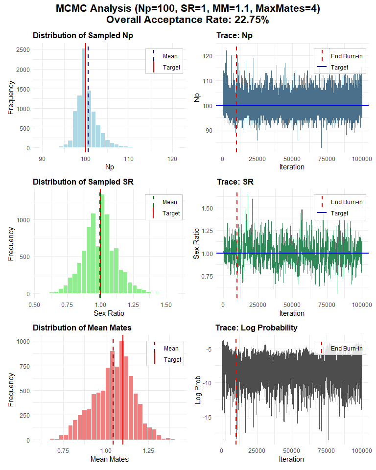
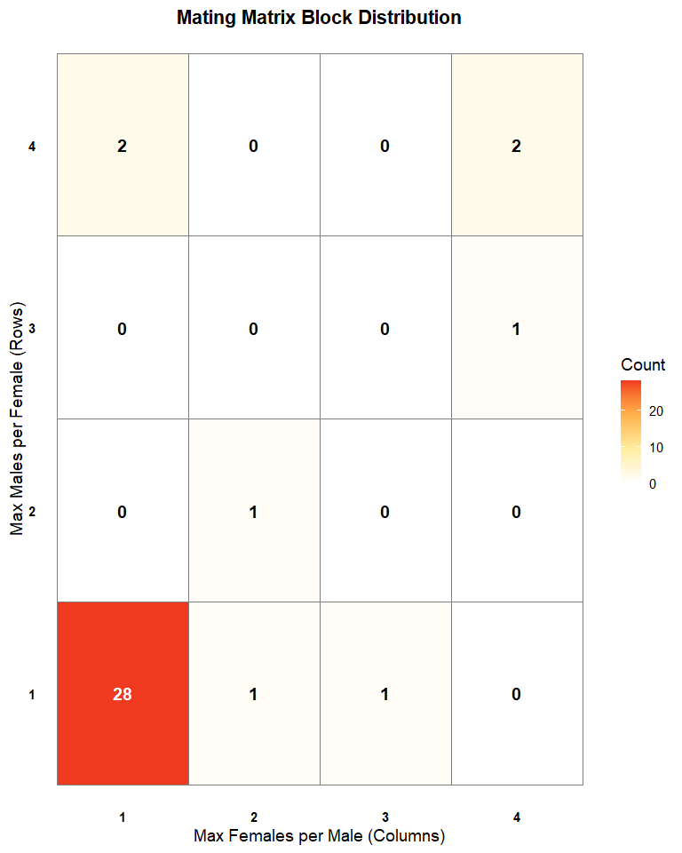
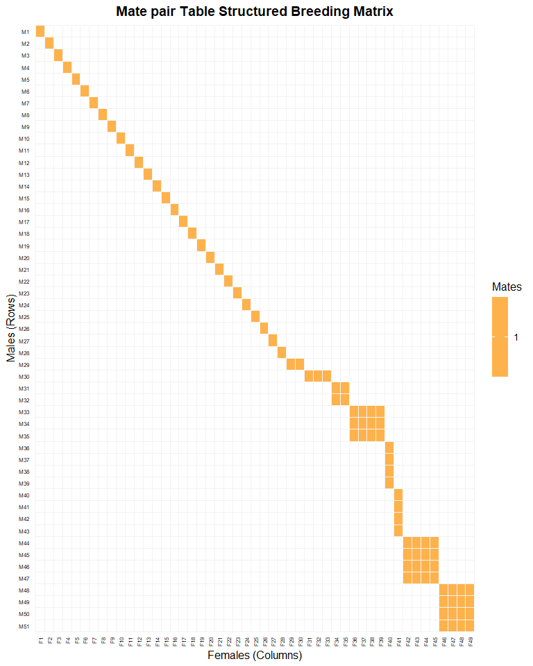
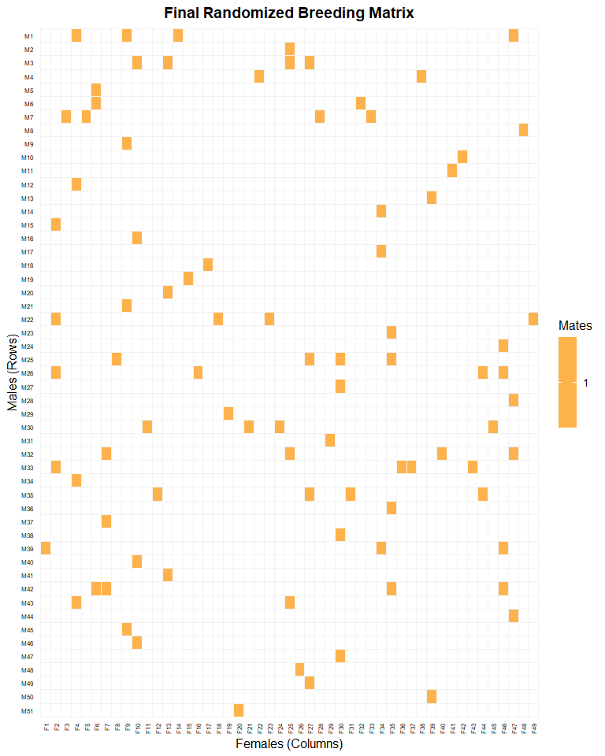
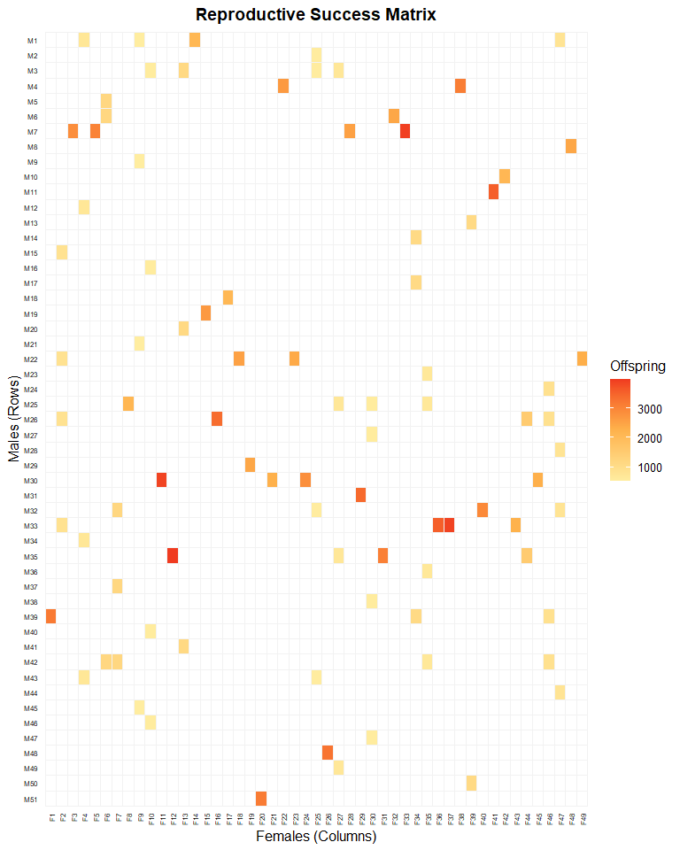

Quickstart: Simulating a Mating Network
================

## Introduction

Welcome to mateR2! This package is designed to simulate highly
realistic, complex mating networks for eco-evolutionary studies.

Generating a realistic breeding matrix requires a two-stage approach:

MCMC Optimization: We use a Markov Chain Monte Carlo sampler to build a
demographic profile that perfectly hits your target Number of Parents
($N_P$), Sex Ratio ($SR$), and Mean Mates per individual ($MM$).

Network Randomization: We use an edge-swapping algorithm to connect
isolated mating blocks into a realistic, continuous population network
without violating the demographic targets.

``` r
library(mateR2)
```

### Step 1: Setting Demographic Targets & MCMC Parameters

First, we define the exact biological targets for our population. In
this scenario, we want exactly 100 parents, an even sex ratio (1.0), and
a slight degree of polygamy (Mean Mates = 1.1).

We also define the MCMC tuning parameters. The decay_constant is a
biological preference parameter: a negative value penalizes highly
complex mating structures (like 4 males mating with 4 females) in favor
of simpler ones (like 1:1 or 1:2). The weights dictate how strictly the
sampler must adhere to our targets.

``` r
# Define demographic goals
targets <- list(Np_target = 100, sr_target = 1.0, mean_mates_target = 1.1)

# Define MCMC tuning parameters
mcmc_specs <- list(
  n_iter = 100000, 
  burn_in = 10000, 
  thin = 10,
  decay_constant = -0.1, 
  np_weight = 60.0, 
  sr_weight = 5.0, 
  mm_weight = 5.0
)
```

### Step 2: Matrix Configuration and Initial State

Next, we establish the maximum allowed complexity for any given mating
block. Here, we restrict the system so that no male can mate with more
than 4 females, and no female can mate with more than 4 males.

``` r
# Build structural configurations
config <- create_config_info(max_males_per_female = 4, max_females_per_male = 4)
head(config)
#>   Block Males Females Complexity_Diff
#> 1   1:1     1       1               0
#> 2   1:2     1       2               1
#> 3   1:3     1       3               2
#> 4   1:4     1       4               3
#> 5   2:1     2       1               1
#> 6   2:2     2       2               2
```

The MCMC sampler needs a starting point. We generate a simple initial
state (primarily relying on 1:1 matings) that approximates our target
$N_P$ and $SR$.

``` r
initial_state <- create_initial_counts(
  config_info = config, 
  Np_target = targets$Np_target, 
  sr_target = targets$sr_target
)
initial_state
#>  [1] 50  0  0  0  0  0  0  0  0  0  0  0  0  0  0  0
```

### Step 3: Running the MCMC Sampler

Now we pass our configurations, targets, and initial state to the
high-performance C++ engine. The sampler explores thousands of possible
mating combinations to find the Maximum A Posteriori (MAP) estimate—the
configuration that best matches our biological goals..

``` r
# Execute the MCMC wrapper using the variables defined in the previous chunk
mcmc_output <- generate_map_table(
  Np_target = targets$Np_target, 
  sr_target = targets$sr_target, 
  mean_mates_target = targets$mean_mates_target,
  max_males_per_female = 4, 
  max_females_per_male = 4,
  decay_constant = mcmc_specs$decay_constant,
  np_weight = mcmc_specs$np_weight,
  sr_weight = mcmc_specs$sr_weight,
  mm_weight = mcmc_specs$mm_weight,
  n_iter = mcmc_specs$n_iter, 
  burn_in = mcmc_specs$burn_in, 
  thin = mcmc_specs$thin,
  initial_method = initial_state, # Feeds your custom counts here!
  seed = 123
)
#> [1] "--- Setting up MCMC ---"
#> [1] "Using provided initial_counts vector."
#> [1] "--- Running MCMC Sampler ---"
#> MCMC finished. Overall Acceptance Rate: 22.75%
#> [1] "Run Time:"
#>    user  system elapsed 
#>    0.10    0.03    0.56 
#> [1] "--- Finding MAP Estimate ---"
#> [1] "--- MAP Estimate Found ---"
#>    Block Males Females MAP_Count
#> 1    1:1     1       1        28
#> 2    1:2     1       2         1
#> 3    1:3     1       3         1
#> 6    2:2     2       2         1
#> 12   3:4     3       4         1
#> 13   4:1     4       1         2
#> 16   4:4     4       4         2
#> [1] "Stats for MAP table:"
#> $Np
#> [1] 100
#> 
#> $SR
#> [1] 1.040816
#> 
#> $MeanMates
#> [1] 0.89
#> 
#> $MaxLogProb
#> [1] -4.059247
#> 
#> [1] "--- Returning Output ---"
```

Once finished, we visually inspect the trace plots to ensure the sampler
reached convergence and stabilized around our target values.

``` r
# Plot diagnostics to visually inspect convergence
plot_mcmc_diagnostics(
  mcmc_output = mcmc_output$mcmc_output, # Extract just the raw MCMC data
  config_info = config,                  # Feed it your block configurations
  target_values = targets,               # Feed it the targets (for the red lines)
  mcmc_params = mcmc_specs,              # Feed it the parameters (for burn-in line)
)
#> Analyzing 9000 stored samples for plotting.
```

<!-- -->
\### Step 4: Visualizing the MAP Estimate

The result of the MCMC run is a “Mate-Pair Summary Table” indicating
exactly how many blocks of each mating type are required. We can view
this distribution as a heatmap.

``` r
# Extract the optimal mate-pair table and map to a binary matrix
plot_mate_matrix(mp_table = mcmc_output$map_table)
```

<!-- -->
We convert this abstract table into an explicit binary matrix (Rows =
Males, Columns = Females). However, as you can see below, this raw MCMC
output creates a strictly “block-diagonal” matrix. The population is
fragmented into isolated islands, which is mathematically optimal but
biologically unrealistic.

``` r
block_matrix <- mp_table_to_matrix(mcmc_output$map_table)

# Visualizing the fragmented, isolated mating blocks
plot_realized_matrix(mat = block_matrix, title = "Mate pair Table Structured Breeding Matrix")
```

<!-- -->
\### Step 5: Network Randomization (Edge-Swapping)

To fix the fragmented topology, we run an edge-swapping routine. This
algorithm rewires the network by swapping mating pairs without changing
any individual’s total mating count.

By preserving the individual marginal totals, our $N_P$, $SR$, and $MM$
stay mathematically perfect, but the network becomes continuous and
realistic.

``` r
# Run the fixed edge-swapping routine to randomize network topology
final_mating_matrix <- randomize_mating_structure(block_matrix, SPE_target = 100)

# Visualize the final, mixed mating network
plot_realized_matrix(mat = final_mating_matrix, title = "Final Randomized Breeding Matrix",fill_label = "Mates")
```

<!-- -->

We can quantify that the network properties realtive to our original
targets (100 Parents, 1.1 Mean Mates) using mat.stats().

``` r
# Confirm Np, Mating counts, and Reproductive Success are accurate
mat.stats(final_mating_matrix)
#>   num.males num.females mp.count mean.male.mates min.male.mates max.male.mates mean.female.mates min.female.mates max.female.mates
#> 1        51          49       89            1.75              1              4              1.82                1                4
#>   mean.male.rs mean.female.rs overall.mean.rs
#> 1         1.75           1.82            0.89
```

### Step 6: Fecundity Allocation

Up to this point, the matrix has been binary (0 = no mating, 1 = mating
success). To generate realistic pedigrees, we must assign biological
fecundity (number of offspring) to each successful mating event.

``` r
# Generate biological offspring distribution matrix
fitness_matrix <- brd.mat.fitness(mat = final_mating_matrix,min.fert=2000, max.fert=4000, type = "uniform")

# Visualize the matrix scaled by reproductive success (offspring counts)
plot_realized_matrix(mat = fitness_matrix, title = "Reproductive Success Matrix",fill_label = "Offspring")
```

<!-- -->
\### Step 7: Sampling pedigrees in the wild Because researchers cannot
sample every individual in a system, we apply our **Null Model**
(`mat.sub.sample`). This simulates a randomly sampling a subset of
juveniles under perfect panmixia. This step perfectly illustrates wild
pedigrees are inherently incomplete as families with small initial
clutch sizes will naturally drop out of the sample.

``` r
#Simulate a researcher sampling 500 offspring from the system
sampled_summary_10 <- mat.sub.sample(mat = fitness_matrix, num_offspring = 10)
sampled_summary_100 <- mat.sub.sample(mat = fitness_matrix, num_offspring = 100)
sampled_summary_1000 <- mat.sub.sample(mat = fitness_matrix, num_offspring = 1000)
# Observe the rarefaction: 
# 'off' is the true egg count, 'off1' is how many the researcher actually sampled
# Notice sample size affects the odds of sampling a full sub
table(sampled_summary_10$off1)
#> 
#>  0  1 
#> 79 10
table(sampled_summary_100$off1)
#> 
#>  0  1  2  3  4  5  6  7  8 
#> 39 25 16  3  2  1  1  1  1
table(sampled_summary_1000$off1)
#> 
#>  1  2  3  4  5  6  7  8  9 10 11 12 13 14 16 17 18 19 20 21 23 25 26 29 33 35 39 
#>  3  1 14  6  6  7  9  3  2  2  3  1  1  2  4  4  4  1  1  3  3  2  2  1  2  1  1
```

Finally, we translate this sampled breeding matrix into a sampled
breeding matrix ready to be fed into genetic simulation software or
pedigree reconstruction tools like COLONY.

``` r
# Convert to a standard pedigree dataframe (Offspring, Mom, Dad)
pedigree <- convert2ped(df = sampled_summary_100)
head(pedigree)
#>     off mom dad
#> 1 off_1   I   I
#> 2 off_2   I   I
#> 3 off_3   I   U
#> 4 off_4   I   U
#> 5 off_5   Y  F1
#> 6 off_6  D1  U1

#And we can convert back to a breeding matrix for quick statistics
sampled_matrix <- ped2mat(ped = pedigree)
mat.stats(mat = sampled_matrix)
#>   num.males num.females mp.count mean.male.mates min.male.mates max.male.mates mean.female.mates min.female.mates max.female.mates
#> 1        33          44       50            1.52              1              4              1.14                1                2
#>   mean.male.rs mean.female.rs overall.mean.rs
#> 1         3.03           2.27             1.3
```
